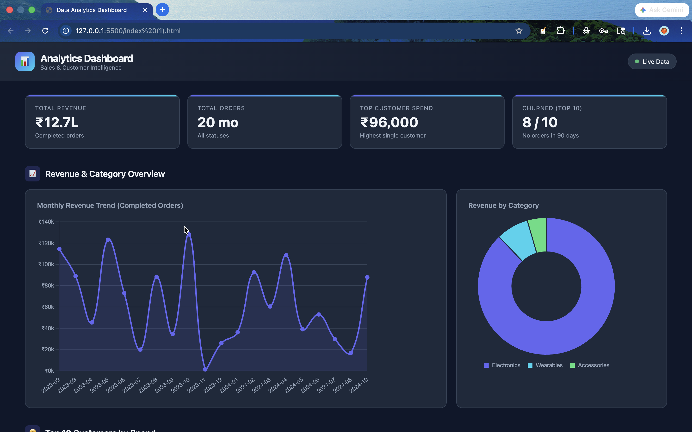
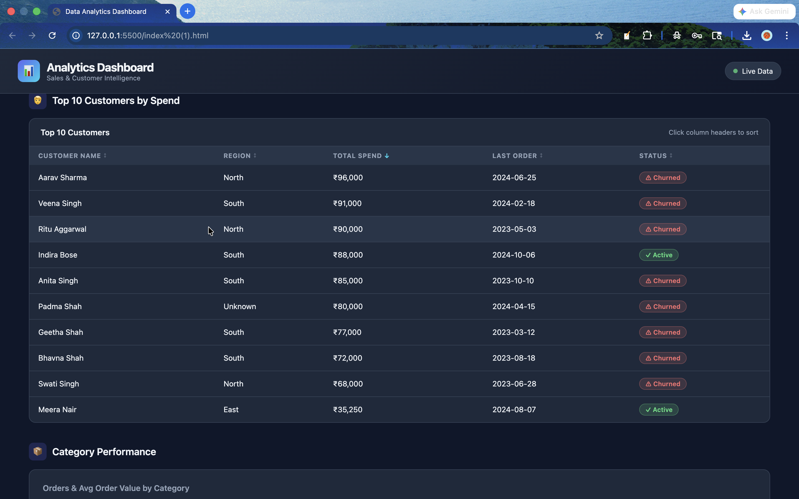
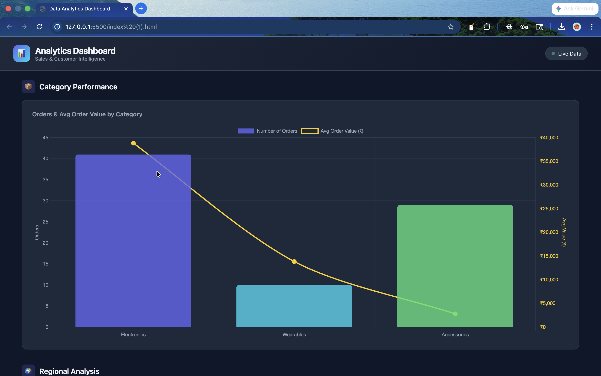
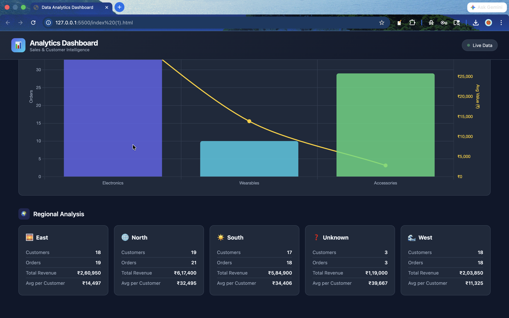

# DataPipeline & Analytics Dashboard

> End-to-end data engineering pipeline: raw CSV ingestion → Python cleaning → business analytics → FastAPI REST layer → interactive frontend dashboard.

[](https://python.org)
[](https://fastapi.tiangolo.com)
[](https://pandas.pydata.org)
[](https://chartjs.org)
[](LICENSE)

---

## Table of Contents

- [Overview](#overview)
- [Pipeline Architecture](#pipeline-architecture)
- [Project Structure](#project-structure)
- [Features](#features)
- [Tech Stack](#tech-stack)
- [Setup & Installation](#setup--installation)
- [Running the Pipeline](#running-the-pipeline)
- [API Reference](#api-reference)
- [Data Flow](#data-flow)
- [Assumptions](#assumptions)
- [Error Handling](#error-handling)
- [Verification Checklist](#verification-checklist)

---

## Overview

This project implements a **3-stage data pipeline** that transforms raw transactional CSV data into actionable business intelligence, exposed via a REST API and visualized in a browser-based dashboard.

## Visual Preview

### Dashboard


### Revenue Chart


### Top Customers Table


### Regional Analysis


| Stage | Script | Input | Output |
|-------|--------|-------|--------|
| 1 — Cleaning | `clean_data.py` | `data/raw/*.csv` | `data/processed/*_clean.csv` |
| 2 — Analysis | `analyze.py` | `data/processed/*_clean.csv` | `data/processed/*_metrics.csv` |
| 3 — Serving | `backend/main.py` | `data/processed/*.csv` | JSON via REST API |
---

## Pipeline Architecture

```
┌─────────────┐     ┌─────────────┐     ┌─────────────┐     ┌─────────────┐     ┌─────────────┐
│   Raw CSVs  │────▶│  clean_     │────▶│  analyze.   │────▶│  FastAPI    │────▶│  Frontend   │
│             │     │  data.py    │     │  py         │     │  Backend    │     │  Dashboard  │
│ customers   │     │             │     │             │     │             │     │             │
│ orders      │     │ dedup       │     │ revenue     │     │ /api/       │     │ Chart.js    │
│ products    │     │ normalize   │     │ churn       │     │ endpoints   │     │ tables      │
│             │     │ impute      │     │ segments    │     │ CORS        │     │ responsive  │
└─────────────┘     └─────────────┘     └─────────────┘     └─────────────┘     └─────────────┘
   data/raw/           data/processed/     data/processed/    :8000               index.html
```

---

## Project Structure

```
project_root/
│
├── clean_data.py               # Stage 1 — raw data ingestion & cleaning
├── analyze.py                  # Stage 2 — data merging & business analysis
├── README.md
│
├── backend/
│   ├── main.py                 # FastAPI app, route definitions, CORS config
│   └── requirements.txt        # Python dependencies
│
├── frontend/
│   └── index.html              # Single-page dashboard (Chart.js + Fetch API)
│
└── data/
    ├── raw/                    # Source files — do not edit manually
    │   ├── customers.csv
    │   ├── orders.csv
    │   └── products.csv
    │
    └── processed/              # Auto-generated by pipeline scripts
        ├── customers_clean.csv
        ├── orders_clean.csv
        ├── monthly_revenue.csv
        ├── top_customers.csv
        ├── category_performance.csv
        └── regional_analysis.csv
```

---

## Features

### 🧹 Data Cleaning (`clean_data.py`)

- **Deduplication** — removes duplicate customer records by ID
- **Email validation** — flags and filters records missing `@` or `.`
- **Date normalization** — parses multiple date formats into ISO 8601
- **Status normalization** — standardizes `order_status` to lowercase canonical values
- **Missing value imputation** — fills missing `amount` with median grouped by product category

### 📊 Business Analysis (`analyze.py`)

- **Monthly revenue trends** — aggregated from completed orders, grouped by month
- **Top customers** — ranked by cumulative lifetime spend (top 10)
- **Category performance** — revenue, order count, and avg. order value per product category
- **Regional analysis** — sales breakdown by geographic region
- **Churn detection** — customers with no completed orders in the last **90 days** (relative to dataset max date)

### ⚡ FastAPI Backend (`backend/main.py`)

- RESTful API with 5 endpoints (see [API Reference](#api-reference))
- CORS middleware configured for frontend access
- HTTP `404` returned when processed CSV is missing
- Structured JSON responses across all routes
- Logging enabled for all pipeline stages and API requests

### 🖥️ Frontend Dashboard (`frontend/index.html`)

- **Revenue Trend** — line chart over time using Chart.js
- **Top Customers** — ranked table sorted by spend
- **Category Performance** — bar/pie chart breakdown
- **Regional Insights** — geographic distribution visualization
- Fully responsive layout for desktop and mobile
- Data fetched live from FastAPI at page load

---

## Tech Stack

| Layer | Technology | Purpose |
|-------|-----------|---------|
| Language | Python 3.9+ | Core pipeline scripting |
| Data Processing | pandas, numpy | Cleaning, merging, aggregation |
| API Framework | FastAPI | REST endpoint definitions |
| ASGI Server | uvicorn | Serving the FastAPI application |
| Frontend | HTML5, Vanilla JS | Dashboard interface |
| Visualization | Chart.js | Interactive charts and graphs |

---

## Setup & Installation

### Prerequisites

- Python **3.9** or higher
- `pip` package manager
- A modern web browser

### 1. Clone / Unzip the Project

```bash
git clone <repository-url>
cd project_root
```

### 2. Create a Virtual Environment

```bash
# Create
python -m venv .venv

# Activate — macOS/Linux
source .venv/bin/activate

# Activate — Windows
.venv\Scripts\activate
```

### 3. Install Dependencies

```bash
pip install -r backend/requirements.txt
```

---

## Running the Pipeline

> **Important:** Run the steps in order. Each stage depends on the output of the previous one.

### Step 1 — Clean Raw Data

```bash
python clean_data.py
```

Reads from `data/raw/` → writes cleaned files to `data/processed/`.

**Expected output:**
```
data/processed/customers_clean.csv
data/processed/orders_clean.csv
```

---

### Step 2 — Run Analysis

```bash
python analyze.py
```

Merges cleaned datasets and generates analytical CSVs in `data/processed/`.

**Expected output:**
```
data/processed/monthly_revenue.csv
data/processed/top_customers.csv
data/processed/category_performance.csv
data/processed/regional_analysis.csv
```

---

### Step 3 — Start the Backend Server

```bash
uvicorn backend.main:app --reload
```

API will be live at: `http://127.0.0.1:8000`

Interactive docs available at: `http://127.0.0.1:8000/docs`

---

### Step 4 — Open the Dashboard

**Option A** — Open directly in browser:
```
frontend/index.html
```

**Option B** — Serve via Python (recommended to avoid CORS issues):
```bash
python -m http.server 3000 --directory frontend/
# Then open: http://localhost:3000
```

---

## API Reference

Base URL: `http://127.0.0.1:8000`

All endpoints return `application/json`. Missing data files return HTTP `404`.

---

### `GET /health`

Returns the operational status of the API.

**Response:**
```json
{
  "status": "ok"
}
```

---

### `GET /api/revenue`

Returns monthly revenue aggregates from completed orders.

**Response:**
```json
[
  { "month": "2024-01", "revenue": 42350.75 },
  { "month": "2024-02", "revenue": 51200.00 }
]
```

---

### `GET /api/top-customers`

Returns the top 10 customers ranked by total spend.

**Response:**
```json
[
  { "customer_id": "C001", "name": "Jane Doe", "total_spend": 15200.00 },
  ...
]
```

---

### `GET /api/categories`

Returns product category performance metrics.

**Response:**
```json
[
  { "category": "Electronics", "revenue": 98000.00, "order_count": 340, "avg_order_value": 288.24 },
  ...
]
```

---

### `GET /api/regions`

Returns regional sales analysis.

**Response:**
```json
[
  { "region": "North", "revenue": 67000.00, "customer_count": 210 },
  ...
]
```

---

## Data Flow

```
data/raw/
  ├── customers.csv    ──┐
  ├── orders.csv       ──┼──▶  clean_data.py  ──▶  data/processed/*_clean.csv
  └── products.csv     ──┘                               │
                                                         │
                                                         ▼
                                                    analyze.py
                                                         │
                              ┌──────────────────────────┤
                              │                          │
                    monthly_revenue.csv         top_customers.csv
                    category_performance.csv    regional_analysis.csv
                              │
                              ▼
                        backend/main.py  (FastAPI reads processed CSVs)
                              │
                    ┌─────────┴──────────┐
                    ▼                    ▼
              /api/revenue         /api/regions
              /api/categories      /api/top-customers
                    │
                    ▼
             frontend/index.html  (fetch API → Chart.js renders)
```

---

## Assumptions

| Area | Assumption |
|------|-----------|
| Email validation | Records missing `@` or `.` are treated as invalid |
| Missing regions | `NULL` or empty region values are replaced with `"Unknown"` |
| Amount imputation | Missing `order_amount` values are filled with the **median** grouped by product category |
| Revenue scope | Only orders with `status = "completed"` are included in revenue calculations |
| Churn definition | A customer is considered churned if they have **no completed orders in the last 90 days** relative to the maximum date in the dataset |
| File paths | All paths are relative to the project root directory |

---

## Error Handling

| Scenario | Behaviour |
|----------|-----------|
| Processed CSV file missing | API returns HTTP `404` with descriptive message |
| Invalid date formats in raw data | Gracefully skipped during parsing; logged as warnings |
| Malformed email addresses | Flagged and excluded during cleaning stage |
| API server not running | Frontend shows fetch error in browser console |
| Empty dataset after filtering | Returns empty array `[]` — no crash |

---

## Verification Checklist

Run through this checklist before submission:

```
Stage 1 — Data Cleaning
  ☐  clean_data.py runs without errors
  ☐  data/processed/customers_clean.csv exists and is non-empty
  ☐  data/processed/orders_clean.csv exists and is non-empty

Stage 2 — Analysis
  ☐  analyze.py runs without errors
  ☐  data/processed/monthly_revenue.csv exists
  ☐  data/processed/top_customers.csv exists
  ☐  data/processed/category_performance.csv exists
  ☐  data/processed/regional_analysis.csv exists

Stage 3 — Backend
  ☐  uvicorn starts without errors
  ☐  GET /health returns {"status": "ok"}
  ☐  GET /api/revenue returns a JSON array
  ☐  GET /api/top-customers returns a JSON array
  ☐  GET /api/categories returns a JSON array
  ☐  GET /api/regions returns a JSON array

Stage 4 — Frontend
  ☐  index.html opens in browser without console errors
  ☐  All charts render with data
  ☐  Tables populate correctly
  ☐  Layout is responsive on mobile screen size
```

---

## Notes

- All file paths are relative to the project root — no absolute paths required
- No manual data manipulation is needed; all scripts are fully automated
- The pipeline is idempotent — re-running any script will overwrite previous outputs cleanly
- Interactive API docs (Swagger UI) are auto-generated at `http://127.0.0.1:8000/docs`

---

## Submission

The project is submitted as a **ZIP archive** containing all files and folders described in [Project Structure](#project-structure).

Before zipping, confirm:
- All scripts run end-to-end without errors
- All API endpoints return correct JSON
- The dashboard loads and displays data correctly
- Folder structure matches requirements exactly

---

*Data Analyst + Fullstack Technical Assignment*